# biggan-deep-512 图片素材

由神经网络 biggan-deep-512 生成的图片

* 模型来源：[https://tfhub.dev/deepmind/biggan-deep-512/1](https://tfhub.dev/deepmind/biggan-deep-512/1)
* 使用 tensorflow 2.3 运行
* 共 1000 类，每类生成 100 张图片，以 jpg 格式储存

网页版：[https://playmat365.github.io/biggan_deep_512/](https://playmat365.github.io/biggan_deep_512/)

# 预览

点击图片可查看该分类

                        [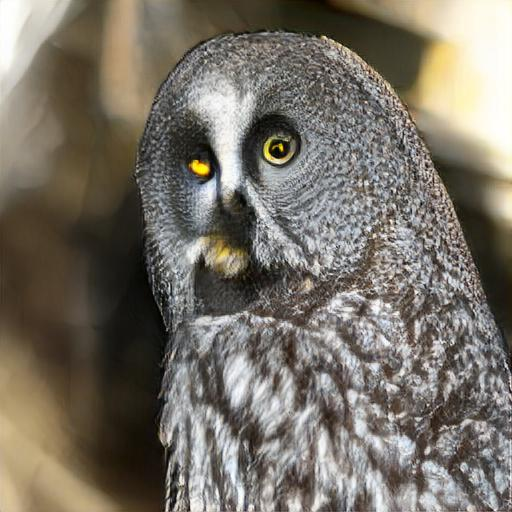](pics/24_猫头鹰_great_grey_owl)   [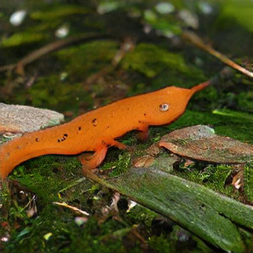](pics/27_壁虎_eft) [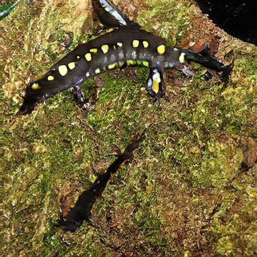](pics/28_壁虎_spotted_salamander)   [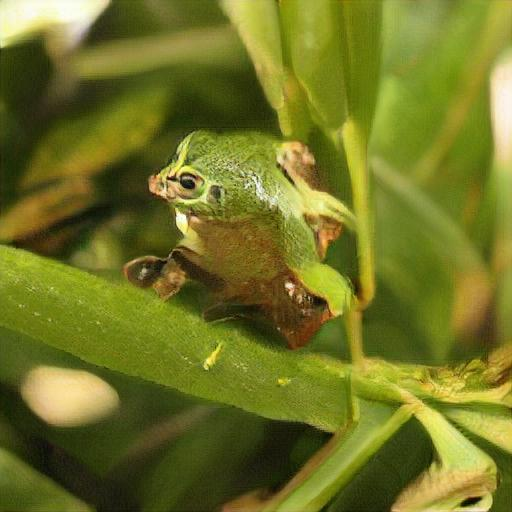](pics/31_青蛙_tree_frog)          [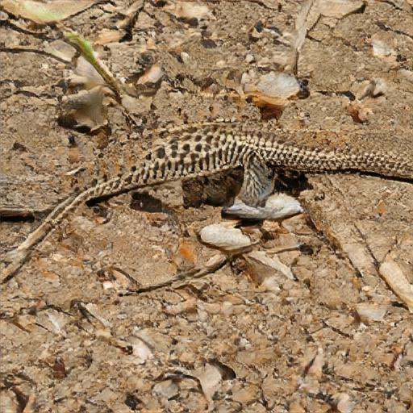](pics/41_蜥蜴_whiptail)        [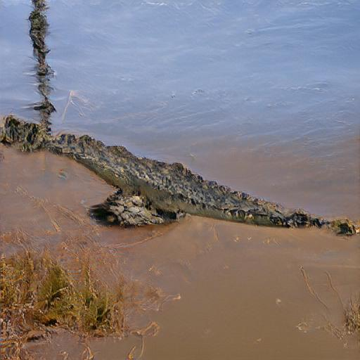](pics/49_鳄鱼_African_crocodile) [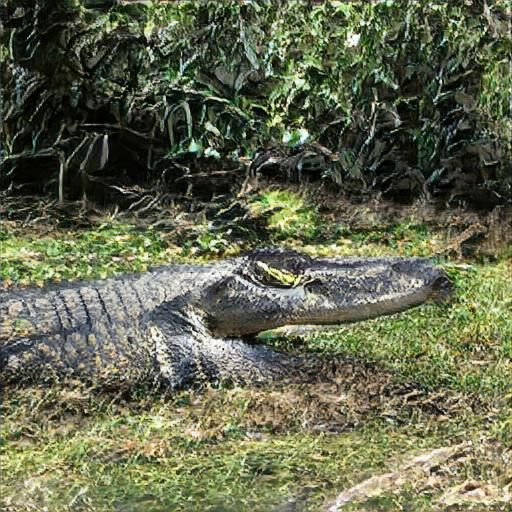](pics/50_鳄鱼_American_alligator) [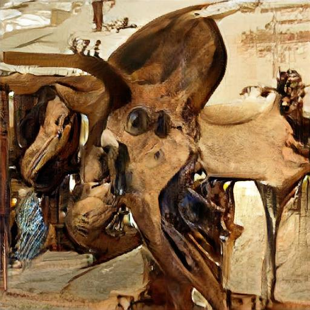](pics/51_恐龙_triceratops)                   [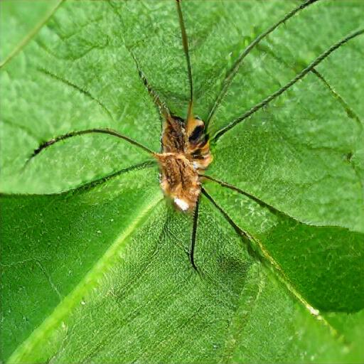](pics/70_蜘蛛_harvestman)  [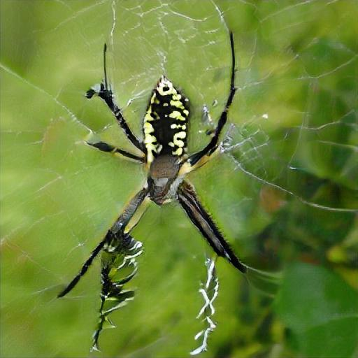](pics/72_蜘蛛_black_and_gold_garden_spider)   [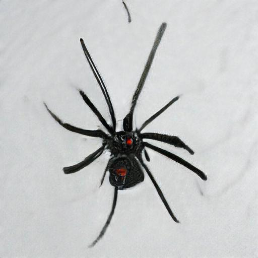](pics/75_蜘蛛_black_widow)  [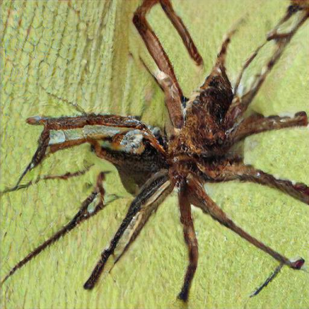](pics/77_蜘蛛_wolf_spider) [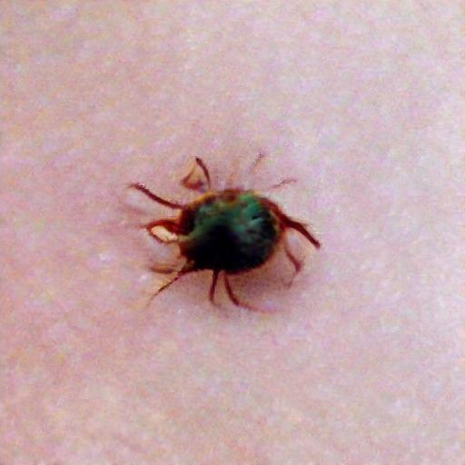](pics/78_蜘蛛_tick)                     

